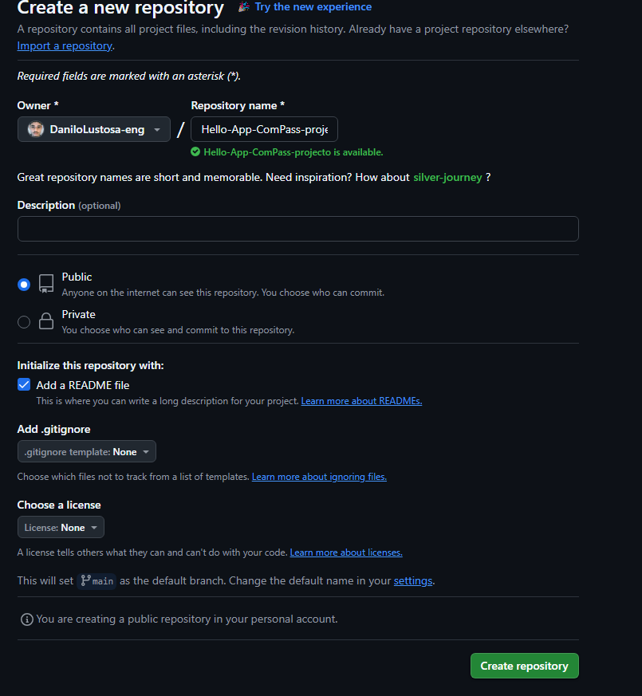
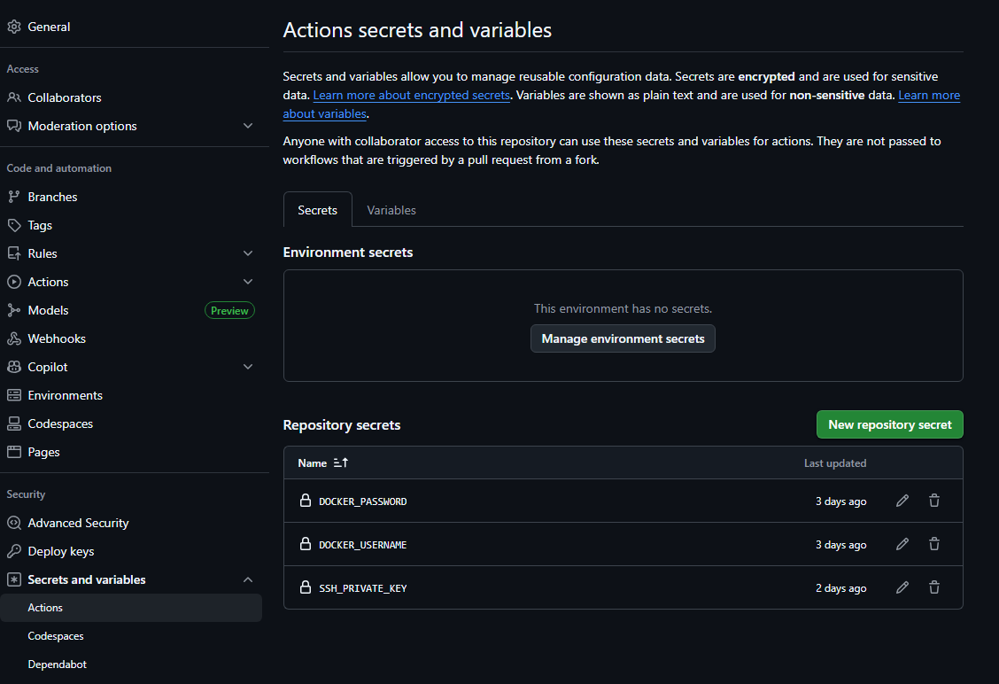
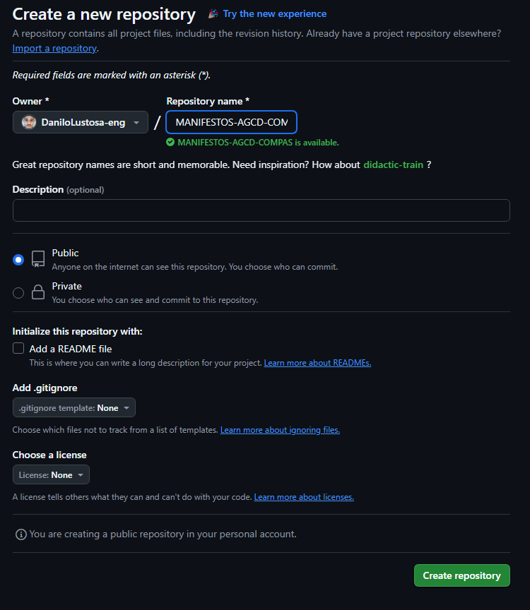
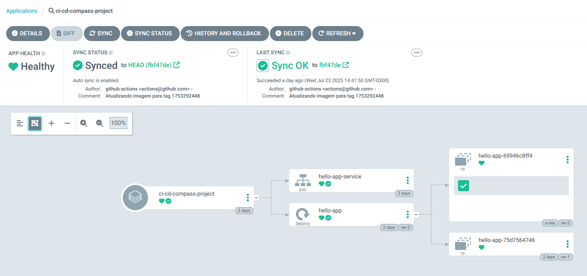
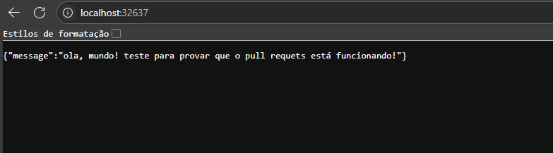

# 🚀 CI/CD com FastAPI usando GitHub Actions, Docker Hub e ArgoCD
##  Introdução 📜
O projeto tem como objetivo automatizar o ciclo completo de desenvolvimento, build, deploy e execução de uma aplicação FastAPI simples, usando GitHub Actions para CI/CD, Docker Hub como registry e ArgoCD para entrega contínua em Kubernetes local com Rancher Desktop.
---
## Tecnologias Utilizadas 🛠️
**Git**: Controle de versão do código fonte.  
**GitHub Actions**: Para automação do CI/CD.  
**Docker Hub**: Para armazenar as imagens Docker da aplicação.    
**ArgoCD**: Para entrega contínua e gerenciamento de aplicações em Kubernetes.

## -1 Criação do Repositório no GitHub que contém o código fonte da aplicação📇​

## -1.1 Criação do Workflow de CI/CD no GitHub Actions ⚙️
**dentro do repositório criado, crie o arquivo `.github/workflows/ci-cd.yml` com o seguinte conteúdo:**
```yaml
name: CI/CD FastAPI App

on:
  push:
    branches:
      - main
  pull_request:
    branches:
      - main

jobs:
  build-and-push:
    runs-on: ubuntu-latest
    steps:
      - name: Checkout código da aplicação
        uses: actions/checkout@v4

      - name: Definir tag com timestamp
        run: echo "IMAGE_TAG=$(date +%s)" >> $GITHUB_ENV

      - name: Login no DockerHub
        run: echo "${{ secrets.DOCKER_PASSWORD }}" | docker login -u "${{ secrets.DOCKER_USERNAME }}" --password-stdin

      - name: Build da imagem Docker
        run: |
          docker build -t ${{ secrets.DOCKER_USERNAME }}/hello-app:${{ env.IMAGE_TAG }} .

      - name: Push da imagem Docker
        run: |
          docker push ${{ secrets.DOCKER_USERNAME }}/hello-app:${{ env.IMAGE_TAG }}

      - name: Checkout do repositório de manifests
        uses: actions/checkout@v4
        with:
          repository: DaniloLustosa-eng/MANIFESTOS-AGCD-COMPASS
          path: manifests
          ssh-key: ${{ secrets.SSH_PRIVATE_KEY }}

      - name: Atualiza deployment.yaml com nova imagem
        run: |
          sed -i 's|image:.*|image: '"${{ secrets.DOCKER_USERNAME }}/hello-app:${{ env.IMAGE_TAG }}"'|g' manifests/manifests/deployment.yaml
          cd manifests
          git config user.name "github-actions"
          git config user.email "actions@github.com"
          git add .
          git commit -m "Atualizando imagem para tag ${{ env.IMAGE_TAG }}"
          git push origin main
```
## -1.2 Criação dos Secrets no GitHub para o Workflow 🔐
**Acesse o repositório no GitHub, vá em "Settings" > "Secrets and variables" > "Actions" e crie os seguintes secrets:**
- `DOCKER_USERNAME`: Seu nome de usuário do Docker Hub.
- `DOCKER_PASSWORD`: Sua senha do Docker Hub.
- `SSH_PRIVATE_KEY`: Sua chave privada SSH para acessar o repositório de manifests do ArgoCD.

   **⚠️​⚠️Observação: a chave SSH será ensinada mais à frente, com instruções de como criá-la.⚠️​⚠️**

## -1.3 Criação dos arquivos .py, .txt e do Dockerfile para construção da imagem.📂
**Crie os seguintes arquivos no repositório:**
- `main.py`: Código da aplicação FastAPI.
```python 
from fastapi import FastAPI

app = FastAPI()

@app.get("/")
async def root():
    return {"message": "ola, mundo! teste para provar que o pull requets está funcionando!"}
```
- `requirements.txt`: Dependências da aplicação.
```plaintext 
fastapi
uvicorn
```
- `Dockerfile`: Instruções para construir a imagem Docker.
```dockerfile
FROM python:3.11-slim

WORKDIR /app

COPY requirements.txt .
RUN pip install -r requirements.txt

COPY . .

CMD ["uvicorn", "main:app", "--host", "0.0.0.0", "--port", "80"]
```
## - Criação do Repositório de Manifests do ArgoCD 🐙​🐱​
**Crie um novo repositório no GitHub chamado `MANIFESTOS-AGCD-COMPASS` e adicione os seguintes arquivos:**
 
- `manifests/deployment.yaml`: Manifesto do Kubernetes para o Deployment da aplicação.
```yaml
apiVersion: apps/v1
kind: Deployment
metadata:
  name: hello-app
spec:
  replicas: 1
  selector:
    matchLabels:
      app: hello-app
  template:
    metadata:
      labels:
        app: hello-app
    spec:
      containers:
      - name: hello-app
        image: danilouser/hello-app:1753292448
        imagePullPolicy: Always
        ports:
        - containerPort: 80
```
- `manifests/service.yaml`: Manifesto do Kubernetes para o Service da aplicação.
```yaml
apiVersion: v1
kind: Service
metadata:
  name: hello-app-service
spec:
  selector:
    app: hello-app
  ports:
    - protocol: TCP
      port: 80
      targetPort: 80
  type: NodePort
```
## -2.1 Criação do Secret SSH 🔑
**Para permitir que o GitHub Actions acesse o repositório de manifests, você precisa criar uma chave SSH:**  
1. No seu terminal, gere uma chave SSH:
```bash
ssh-keygen -t rsa -b 4096 -C "
```
## -2.2 Adicione a chave pública ao repositório de manifests:
2. Acesse o repositório `MANIFESTOS-AGCD-COMPASS` no GitHub.
3. Vá em "Settings" > "Deploy keys" > "Add deploy key".
4. Cole a chave pública gerada (`id_rsa.pub`) e marque a opção "Allow write access".
5. Salve a chave.
## -2.3 Adicione a chave privada como um Secret no repositório principal:
6. Acesse o repositório principal onde está o workflow do GitHub Actions.
7. Vá em "Settings" > "Secrets and variables" > "Actions" > "Edit SSH_PRIVATE_KEY".
8. Cole o conteúdo da chave privada (`id_rsa`).
9. Salve o Secret.
## -3 Configuração do ArgoCD para Deploy Contínuo 🐋​
**Para configurar o ArgoCD, siga os passos no repositório anexado:**   
🔗 [Link para o repositório do ArgoCD](https://github.com/DaniloLustosa-eng/PROJETO-COMPASS-KS8)
## terá um aplicação como essa:
 
## -4 Após o Deploy, acesse a aplicação:
**Pelo terminal, obtenha o NodePort do serviço:**
```bash
kubectl get svc hello-app-service -n argocd
``` 
**Acesse a aplicação pelo navegador:**



